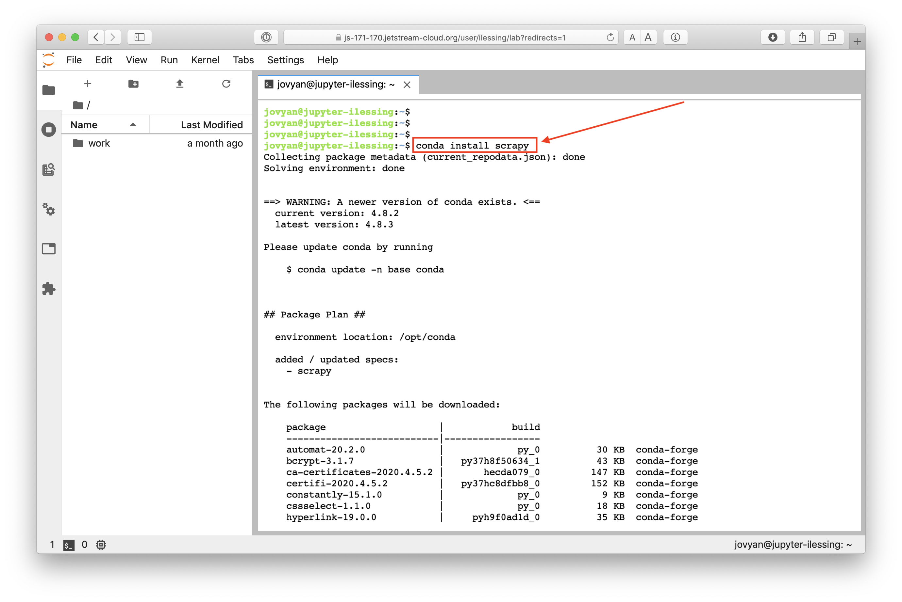

<a class="btn btn-primary" href="../">
Return to Lesson
</a>

In order to follow this lesson, you will need to make sure the following software is installed on your computer.

## Part one: Manually scrape data using browser extensions

For the first half of the lesson, we will use a Chrome browser extension to get started with web scraping.

1. Please ensure you have a working copy of the [Chrome browser](https://www.google.com/intl/en/chrome/browser/).
2. Using Chrome, download and enable the [Scraper extension](https://chrome.google.com/webstore/detail/scraper/mbigbapnjcgaffohmbkdlecaccepngjd).

## Part two: Write small Python programs to automatically scrape data

### Python
The second part of the lesson requires the Python programming language and access to a command-line 
interface (shell) on your computer. Please refer back to [the workshop's setup 
instructions for *Python*](/2020-06-03-UCSBLibCarp/setup/setup.html) for 
*Python* if you need guidance.

> ## Preparing for the workshop
> In this part of the lesson, we will apply 
> our new shell skills.
> If you want to learn more about the basics of python, work your way through 
> a Python carpentry lesson:
>
> * [Programming with Python](http://swcarpentry.github.io/python-novice-inflammation/)
>
{: .prereq}

## Scrapy

> ## for June 17, 2020 Jupyter Lab
> For our June 17th, 2020 Workshop we'll be using a Jupyter Hub/Jupyter Lab web based python development environment.   So you will NOT need to install Python locally.  You'll use python through your web browser for this workshop.
>
> Within Jupyter Lab you will need to install scrapy by entering `conda install -y scrapy` in the terminal.
> Instructor will go over this process during the workshop.
>
> 
>
>  The instructions below are for anyone doing this lesson outside of our live workshop.
{: .keypoints}

Once you have a working installation of Python, the next step is to install [Scrapy](https://scrapy.org/).

If you have installed Python using the Anaconda framework as suggested on the workshop homepage
setup instructions, you can easilly install Scrapy by doing the following:

1. Open a new shell (e.g. Terminal on Mac, or the Anaconda command-line tool on Windows)
2. Type the following:

> conda install -c conda-forge scrapy
>
{: .source}

Alternatively, if you have another distribution of Python, you can try using pip:

> pip install Scrapy
>
{: .source}

If you run into issues while installing Scrapy, refer to the
[official Scrapy install guide](https://doc.scrapy.org/en/latest/intro/install.html#intro-install)
or get in touch with your lesson instructor.
